## Full-Stack Monorepo Project

This repository contains the full-stack code for our project, managed as a `pnpm` workspace.

### 📦 Monorepo Structure

- `/package.json`: The root "manager" for the whole workspace.
- `/packages/client`: The React + Vite frontend.
- `/packages/server`: The Express + TypeScript backend.
- `/packages/shared`: Shared code (like types) used by both the client and server.

---

### 🚀 Getting Started

Follow these steps _in order_ to get your local environment set up correctly.

#### 1. Prerequisites

- [Node.js](https://nodejs.org/) (v18 or higher recommended)
- [Git](https://git-scm.com/)

This project uses `pnpm` to manage dependencies. We enforce a specific version using `corepack`.

#### 2. Local Setup

1.  **Clone the Repository**

    ```bash
    git clone <your-repo-url>
    cd <your-repo-name>
    ```

2.  **Enable Corepack**
    This command will read our `package.json` and ensure you are using the _exact_ same `pnpm` version as the rest of the team.

    ```bash
    corepack enable
    ```

> [!TIP]  
> Run the command above with **administrator terminal**.

> [!IMPORTANT]
> **After enabling corepack**, run `corepack prepare pnpm@latest --activate`

3.  **Set pnpm Config**
    This is a **critical one-time setup step**. It tells `pnpm` to correctly link our local packages (`client`, `server`, `shared`) together.

    ```bash
    pnpm config set link-workspace-packages true
    ```

4.  **Install All Dependencies**
    This single command will install everything for the root, client, server, and shared packages.

    ```bash
    pnpm install
    ```

---

### 💻 Development

**All `pnpm` commands should be run from the root of the repository.**

| Command           | Description                                                     |
| :---------------- | :-------------------------------------------------------------- |
| **`pnpm dev`**    | **(Default)** Runs both the client and server at the same time. |
| `pnpm dev:client` | Runs _only_ the frontend (Vite).                                |
| `pnpm dev:server` | Runs _only_ the backend (Express).                              |

## 📷 Documentation

### 🔒 Authentication

### 📚 Book Management

#### 1. Book List

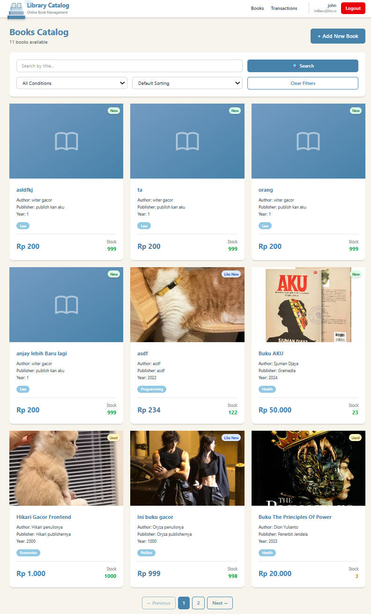

##### Max Page


##### Search Book

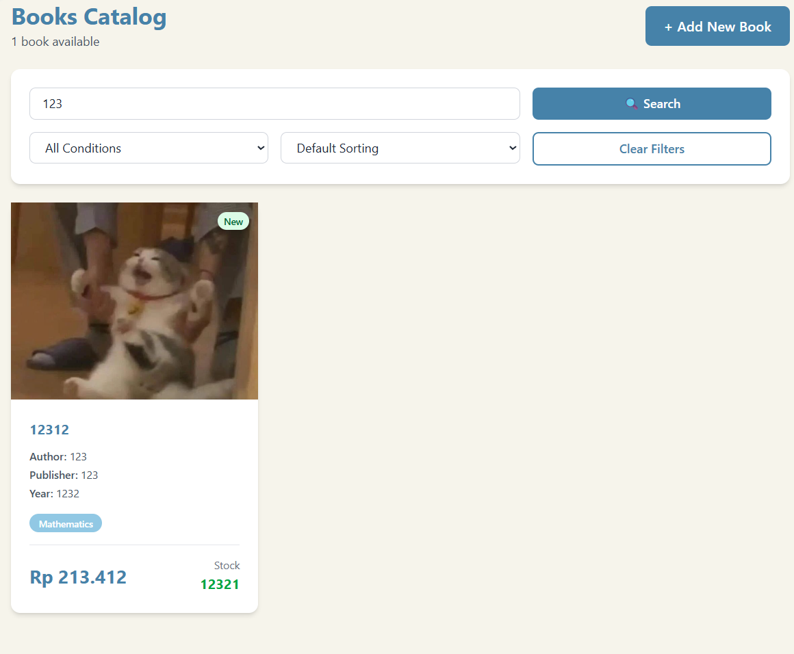

##### Sort Book Descending Order

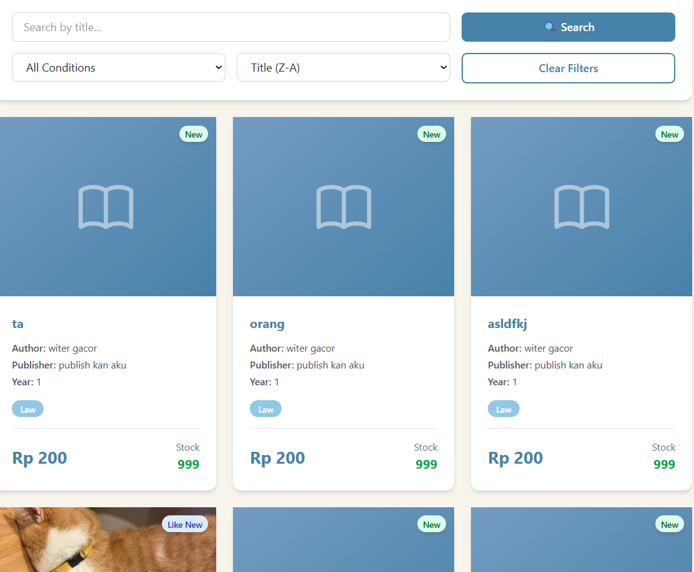

##### Sort Book Newest Publication Date


##### Sort Book Conditionally


#### 2. Book Details

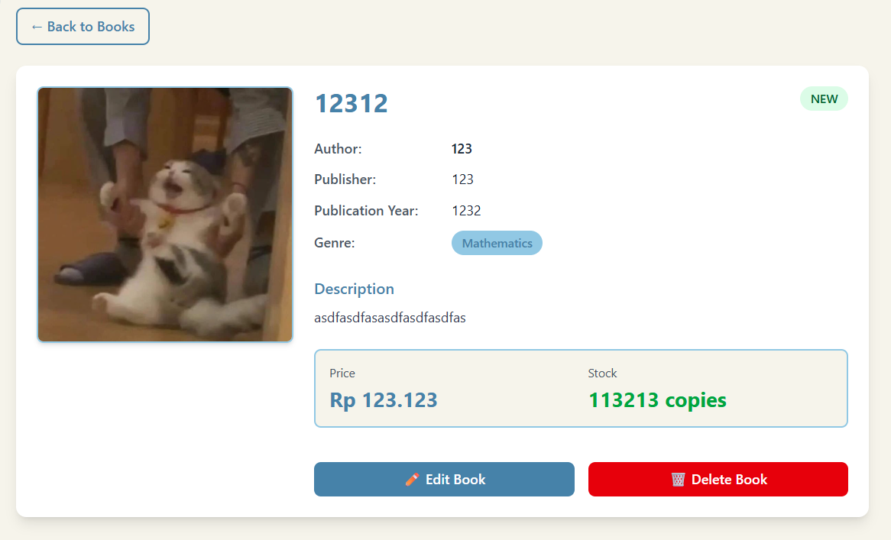

##### Edit Book

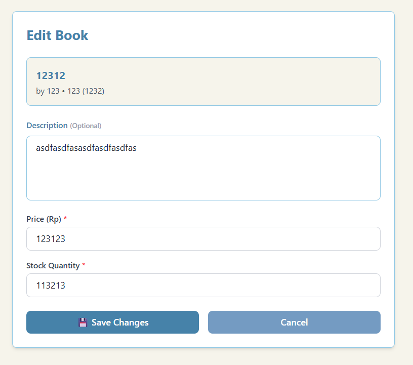

##### Delete Book

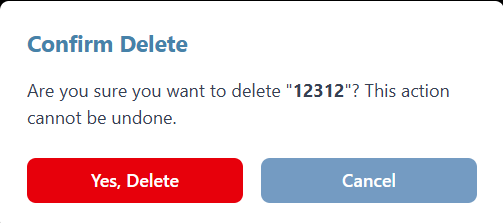

#### 3. Add Book

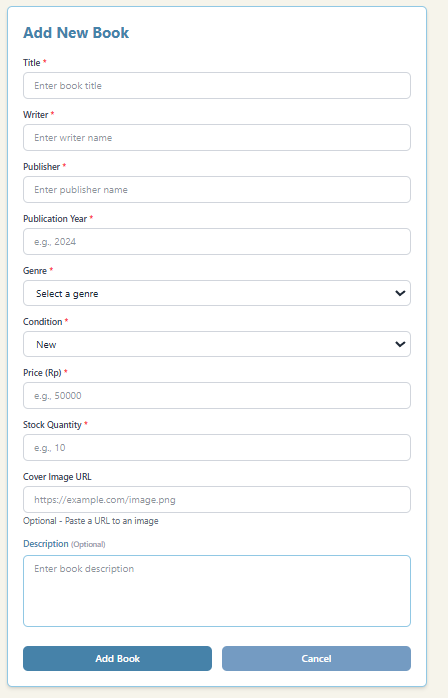

##### Conditional Dropdown

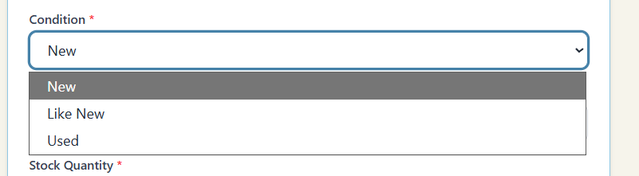

##### Genre Dropdown

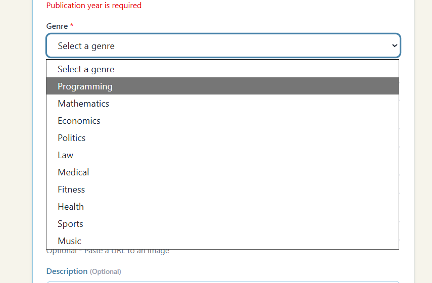

##### Image Preview

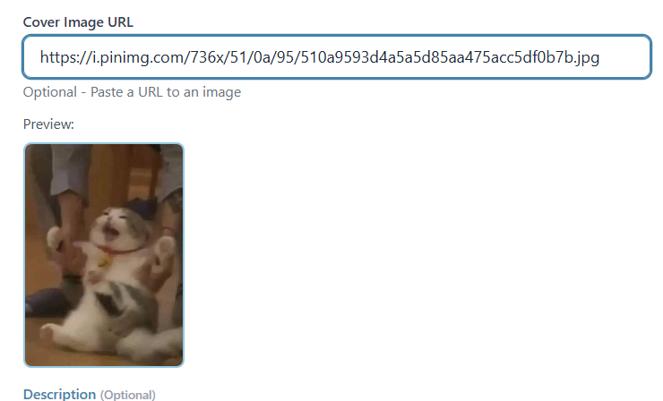

##### Required Fields

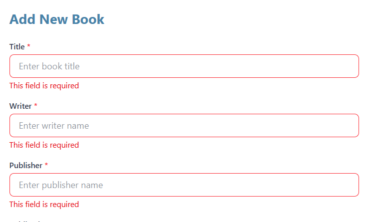

##### Year Error Handling 1

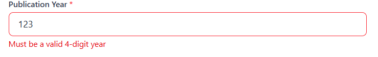

##### Year Error Handling 2

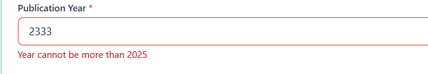

### 📃 Transaction
